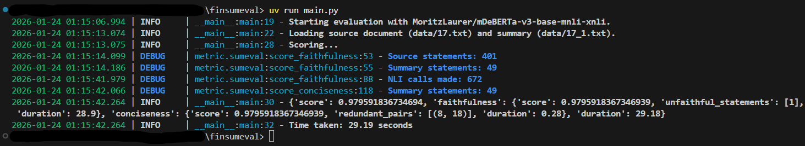

# Summarization evaluation metric

This is a first prototype for my evaluation metric.

## Installation & Requirements

### 1. Clone the repo

```bash
git clone https://github.com/stefsyrsiri/finsumeval.git
cd finsumeval
```

### 2. Install `uv` package manager

Follow the [instructions](https://docs.astral.sh/uv/getting-started/installation/) in the official documentation depending on your OS.

### 3. Add data

Create a `data` directory at the root and add the two following .txt files from the `FNS Shared Task English dataset`, one for the source document and one for the summary to be evaluated.

- `17.txt` annual report
- `17_1.txt` gold summary

## Usage

Install the project's dependecies with uv

```bash
uv sync --lock
```

Run the script

```bash
uv run main.py
```

The console logs should look like this:



### Important

Please, note down **your** execution time from the console log for the `"MoritzLaurer/mDeBERTa-v3-base-mnli-xnli"` model.

My execution time was ~30 seconds.
